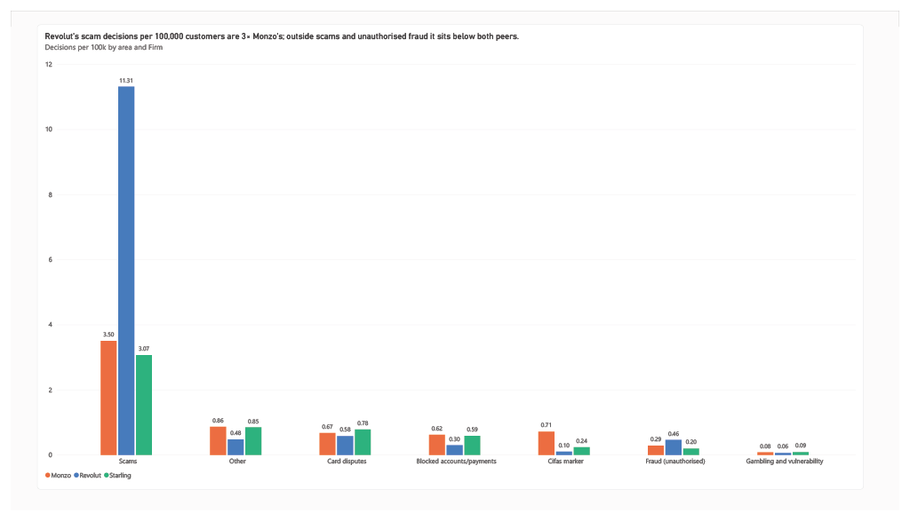
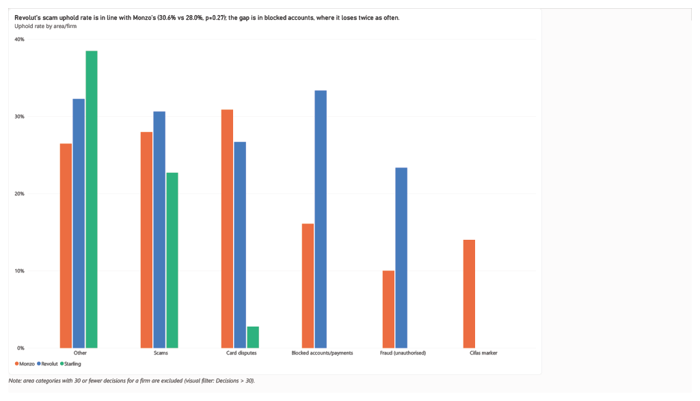

# Where UK digital banks lose at the Ombudsman — and what it costs

Revolut's customers take more complaints to the Financial Ombudsman than any other UK digital bank according to the Ombudsman's business data. This project seeks to find trends in what the complaints are about, how often Revolut loses them and how this compares to its rival digital banks.

This project shows that scam complaints are at the forefront of Revolut's Ombudsman cases. Across 2,937 published Ombudsman decisions in 2025, scam complaints account for 85% of Revolut's decisions, compared to 52% for both Monzo and Starling. Adjusted for customer numbers, Revolut's customers reach a final decision on a scam complaint around three times as often as Monzo's: 11.3 against 3.5 per 100,000 customers. It is also found that Revolut loses a higher percentage of the cases that are published, with an uphold rate of 30.0% across all complaint types against 24.8% and 19.9% for Monzo and Starling respectively. However, this number changes when uphold rates in the scam area alone are observed, with Revolut sitting at 30.6%, only slightly above Monzo's 28.0%, a difference that is not statistically significant (p=0.27). This reveals that the problem Revolut faces is one to do with volume, not decision quality. If efforts were made to reduce Revolut's scam cases per customer so that it would align with Monzo's, it would avoid roughly 1,000 cases a year, which in Ombudsman fees alone equates to £600,000–700,000 a year at most.

---

## Headline findings

The first two findings need no customer numbers: they are shares and rates within each firm's own cases. The third does, so it is reported as a range.

### 1. Revolut loses more of the decisions it reaches

| Firm | Decisions (2025) | Upheld | Uphold rate |
|---|---|---|---|
| Revolut | 1,727 | 518 | **30.0%** |
| Monzo | 943 | 234 | 24.8% |
| Starling | 267 | 53 | 19.9% |

An upheld decision means the Ombudsman found in the customer's favour after the firm had already rejected the complaint.

### 2. Revolut's problem is concentrated in one category


Complaint areas, 2025 (counts, uphold rate in brackets):

| Area | Revolut | Monzo | Starling |
|---|---|---|---|
| Scams | **1,470 (30.6%)** | 490 (28.0%) | 141 (22.7%) |
| Card disputes | 75 (26.7%) | 94 (30.9%) | 36 (2.8%) |
| Fraud (unauthorised) | 60 (23.3%) | 40 (10.0%) | 9 (n/a) |
| Blocked accounts/payments | 39 (**33.3%**) | 87 (16.1%) | 27 (n/a) |
| Cifas marker | 13 (n/a) | 100 (14.0%) | 11 (n/a) |
| Gambling and vulnerability | 8 (n/a) | 11 (n/a) | 4 (n/a) |
| Other | 62 (32.3%) | 121 (26.4%) | 39 (38.5%) |

Rates are not shown where there are fewer than 30 cases.

Scams are 85% of Revolut's decisions against 52% for both peers. Two secondary points: when Revolut is challenged on blocking an account it loses a third of the time, its worst category and the highest of the three firms; and Cifas fraud markers are a Monzo issue (100 cases) rather than a Revolut one (13).

### 3. Per customer, Revolut's scam escalations are about three times Monzo's



This comparison depends on customer numbers, which the firms publish at different dates and on different bases, so it is reported as a range across every published basis rather than as a single figure.

| Basis | Revolut | Monzo | Starling | Revolut vs Monzo |
|---|---|---|---|---|
| Latest published (Revolut 13m Jan 2026, Monzo 14m Nov 2025, Starling 4.6m Mar 2025) | 11.3 | 3.5 | 3.1 | 3.2× |
| Earlier published (Monzo 12m Feb 2025) | 11.3 | 4.1 | 3.1 | 2.8× |
| Estimated at 30 June 2025 | 13.9 | 3.9 | 3.0 | 3.6× |

*Scam decisions per 100,000 customers, 2025.*

Revolut's customers reach a final Ombudsman decision on a scam complaint roughly three times as often as Monzo's — between 2.8× and 3.6× depending on which published figure is used. The direction is the same on every basis; the precise multiple is not knowable from outside.

### 4. What closing the gap would be worth



If Revolut's scam decisions per customer matched Monzo's, it would have had roughly 450–530 scam decisions instead of 1,470 — about 940 to 1,060 fewer cases, worth up to £639,000–£719,000 in Ombudsman case fees (at the maximum £680 per case).

Fees are the floor, not the total. Each case also carries internal handling time, and 30.6% end in redress paid to the customer.

---

## Recommendations

### 1. Find the root cause of scam volume, not scam decisions

My first recommendation would be to look at trends in the scam complaints before escalation, more specifically in finding the root cause of scam volume, not scam decisions. I'd look for why Revolut has a higher volume of scam complaints and what could then be done to offset this. I'd investigate the source of the scams to determine whether or not this is where the volume problem is arising from. I'd split the scam cases into type categories (Job, Investment, Purchase, romance etc.), Payment rail (card, bank transfer, crypto etc.), customer tenure and over time. If one of these areas dominate, that's where I'd look the hardest.

Each of these 1,470 cases reached the Ombudsman because Revolut's own answer didn't satisfy the customer. If one was to look at the number of scam cases, not just being taken but then being lost to the Ombudsman, you'd see a much higher raw number for Revolut than its rival banks. This makes it easy to believe that Revolut's decision making on these complaints initially is misaligned with the Ombudsman policies, causing the higher number of upheld scam-related decisions. However, whilst Revolut's uphold rate (30.6%) is higher than Monzo's (28.0%), it is not significantly as such (p=0.27) which doesn't support the issue being in the decision quality. The greatest difference between the two banks lies the number of scam complaints per 100,000 customers. With Revolut's 11.3 versus Monzo's 3.5 and the proportion of its complaints that are scam-related, with Revolut sitting at 85% against Monzo's 52%. This means that Revolut not only has over three times as many scam complaints per customer being taken to the Ombudsman, but it also accounts for a greater proportion of its overall complaints. This points in the direction of problems such as the app not having adequate warnings against potential scams or to a case of scammers targeting Revolut customers specifically, for which the investigation above would aim to pinpoint.

Decreasing the volume of scam complaints to align with that of Monzo's would mean a decrease in around 1,000 ombudsman decisions, which could be worth up to £0.6–0.7m in Ombudsman fees, so knowing what the root cause is for the increase in scams should be first priority.

### 2. Review blocked-account decisions

My second recommendation would be to review the blocked account decisions taken to the Financial Ombudsman and look into why they are being upheld. Similar to the previous recommendation, I'd look for trends in those upheld complaints, such as reason given for account being blocked or communication following an account block, from which we can then begin taking action.

Unlike the scam complaints, the number of cases escalated are low in volume (39). However, the blocked-account related cases taken to the Financial Ombudsman were upheld against Revolut 33.3% of the time, a number significantly higher (p=0.03) than that of Monzo's (16.1%). It is also Revolut's highest uphold rate category in cases taken to the Ombudsman, meaning Revolut's blocked-account decisions are overturned roughly twice as often as Monzo's.

Decreasing the uphold rate in cases taken to the Ombudsman would benefit the firm in many ways. A frozen account completely restricts the user from access, cutting them off from their money. This is exactly the sort of thing that would attract regulatory attention, so tackling this would be a high priority task in my opinion. A few other reasons to look into this are the costs of the cases. Losing a case costs more than winning one: the case fee falls by £180, to £500, when referred by a professional representative. The larger cost of an upheld decision is the redress paid to the customer as well as the 'trust' between the bank and customer, which will very likely decrease with lack of access. The uphold rate being high may also incline customers to more frequently escalate cases.

### 3. Measure the escalation funnel

Finally, I'd recommend looking at the escalation funnel. This is the complaints taken to the Ombudsman with respect to total complaints closed for each area. One of the limitations of this analysis is that it is based on the published decisions from the Financial Ombudsman. This means that the cases that aren't taken up to that stage aren't accounted for, and establishing where the problem lies sets up a different approach for the solution. For example, the 3x gap in escalated scam cases could be caused by Revolut customers suffering more scams, or a larger proportion of those that complain choose to escalate. For the former, the operational response would become prevention and for the latter, it would be focused on complaint handling.

---

## Method

1. **Collect.** Python scraper (`requests` + `BeautifulSoup`) over the Ombudsman's published decisions search, one request per second, pages cached so nothing is fetched twice. Three searches: Revolut, Monzo, Starling, banking sector, 1 Jan – 31 Dec 2025.
2. **Parse.** Regular expressions pull reference, date, firm, outcome, product and complaint summary from each result.
3. **Classify.** Rule-based classifier assigns each decision one complaint area, rules applied in priority order so categories are mutually exclusive.
4. **Normalise.** Decisions per 100,000 customers, on each published customer basis.
5. **Size.** The difference between Revolut's scam rate and its peers', valued at the Ombudsman case fee.

### Why classification by rules rather than by hand

The first approach counted keyword search results on the Ombudsman site. Spot checks showed the keywords overlapped badly: a search for "fraud" returned mostly scam cases, because scam decisions mention both words, and "refund" matched nearly everything, since a refund is what almost every complainant wants. Keyword counts cannot produce mutually exclusive categories.

The rules classify on **what went wrong, not what the customer asked for**: a scam victim requesting a refund is a scam case, not a card dispute. Priority order resolves mixed cases, which makes the result reproducible and the logic arguable.

### Validation

- **Scrape reconciled to published totals:** Revolut 1,727 of 1,727 and Starling exact; Monzo 943 of 944 (one decision missed, 0.1%).
- **Classifier:** rules refined against a sample of 30 hand-classified decisions, then validated against a second, independent sample of 30 — **90% agreement**. Disagreements were mixed scam/unauthorised cases and payment types outside the card rule (direct debits).

### Data quality issues found and fixed

| Issue | Effect | Fix |
|---|---|---|
| Searching "Starling" also matched **Startline Motor Finance** | 104 unrelated motor-finance decisions in the Starling data, with a 40% uphold rate, inflating Starling's rate from 19.9% to 25.6% | Filter firm names against the search term |
| Summaries don't always repeat the decision reference | 9 rows failed to parse | Made that element optional in the pattern |
| Source text uses curly apostrophes | `didn't authorise` never matched, so unauthorised-payment cases were misfiled as scams | Normalise apostrophes before matching |
| December-only sample considered early on | December's uphold rate (11%) is a third of the 2025 rate (30%) | Abandoned sampling; used the full year |
| Summaries are truncated, anonymised excerpts | ~3% of rows are textually identical to another decision | Decision reference is the unique key; never deduplicate on text |

---

## Customer numbers

| Firm | Figure | Basis | As at | Source |
|---|---|---|---|---|
| Revolut | 13m | UK customers | Jan 2026 | [Revolut](https://www.revolut.com/blog/post/revolut-number-of-customers/) |
| Monzo | 14m | Total customers | Nov 2025 | [fintech.global](https://fintech.global/2025/11/24/monzo-unveils-new-features-amid-surge-past-14m-users/) |
| Monzo | 12m | Total customers | FY25, Feb 2025 | [Monzo Annual Report 2025](https://monzo.com/annual-report/2025) |
| Starling | 4.6m | Customer **accounts** (3.0m active core accounts) | 31 Mar 2025 | [Starling Annual Report 2025](https://www.starlingbank.com/investors/2025/annual-report-2025/) |

No two firms publish on the same date or the same basis, and Monzo grew from 12m to 14m during 2025, so any single per-customer ratio is sensitive to which figure is chosen. That is why finding 3 is a range, and why findings 1 and 2 — which need no denominator — carry the argument. Starling publishes accounts rather than customers; using the larger 4.6m figure is the conservative choice, as it lowers Starling's rate and narrows Revolut's gap.

---

## Limitations

- **Published final decisions only.** Most complaints are resolved before an ombudsman issues a decision, so this is the tip of the funnel. "30% uphold rate" means 30% of published decisions, not 30% of complaints.
- **No causation.** A higher escalation rate per customer is consistent with explanations this data cannot separate: customer mix (Revolut skews towards international and crypto payments, where scams concentrate), how easily customers escalate, use of claims management firms, and first-line complaint handling.
- **Many complaints arrive via professional representatives,** which affects volumes independently of the underlying service.
- **90% classifier accuracy** means roughly 1 in 10 decisions sits in the wrong category. Large categories are robust to this; small ones are not.
- **Case fee is a maximum (£680)** and firms receive an annual allowance, so fee figures are an upper bound.
- **Customer numbers are self-reported,** differently defined and differently dated (see above).

---

## Reproducing this

```
notebooks/scrape_fos.ipynb            # collection, parsing, classification
data/fos_decisions_2025.csv           # raw scrape, 2,937 decisions
data/fos_classified_2025.csv          # with complaint areas
Report/Visualisation_of_FOS.pbix      # Power BI report
charts/                               # exported chart images
```


**Data sources:** [Ombudsman decisions database](https://www.financial-ombudsman.org.uk/businesses/resolving-complaint/ombudsman-decisions/search) · [Ombudsman case fees](https://www.financial-ombudsman.org.uk/businesses/resolving-complaint/case-fees) · firm customer figures as above. Data collected October 2026; robots.txt permits access to the decisions search.
